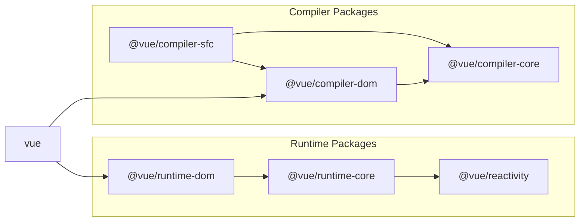

# Vue.js Contributing Guide

Hi! I'm really excited that you are interested in contributing to Vue.js. Before submitting your contribution, please make sure to take a moment and read through the following guidelines:

- [Code of Conduct](https://vuejs.org/about/coc.html)
- [Issue Reporting Guidelines](#issue-reporting-guidelines)
- [Pull Request Guidelines](#pull-request-guidelines)
- [Development Setup](#development-setup)
- [Scripts](#scripts)
- [Project Structure](#project-structure)
- [Contributing Tests](#contributing-tests)
- [Financial Contribution](#financial-contribution)

## Issue Reporting Guidelines

- Always use [https://new-issue.vuejs.org/](https://new-issue.vuejs.org/) to create new issues.

## Pull Request Guidelines

### What kinds of Pull Requests are accepted?

- Bug fix that addresses a clearly identified bug. **"Clearly identified bug"** means the bug has a proper reproduction either from a related open issue, or is included in the PR itself. Avoid submitting PRs that claim to fix something but do not sufficiently explain what is being fixed.

- New feature that addresses a clearly explained and widely applicable use case. **"Widely applicable"** means the new feature should provide non-trivial improvements to the majority of the user base. Vue already has a large API surface so we are quite cautious about adding new features - if the use case is niche and can be addressed via userland implementations, it likely isn't suitable to go into core.

  The feature implementation should also consider the trade-off between the added complexity vs. the benefits gained. For example, if a small feature requires significant changes that spreads across the codebase, it is likely not worth it, or the approach should be reconsidered.

  If the feature has a non-trivial API surface addition, or significantly affects the way a common use case is approached by the users, it should go through a discussion first in the [RFC repo](https://github.com/vuejs/rfcs/discussions). PRs of such features without prior discussion make it really difficult to steer / adjust the API design due to coupling with concrete implementations, and can lead to wasted work.

- Chore: typos, comment improvements, build config, CI config, etc. For typos and comment changes, try to combine multiple of them into a single PR.

- **It should be noted that we discourage contributors from submitting code refactors that are largely stylistic.** Code refactors are only accepted if it improves performance, or comes with sufficient explanations on why it objectively improves the code quality (e.g. makes a related feature implementation easier).

  The reason is that code readability is subjective. The maintainers of this project have chosen to write the code in its current style based on our preferences, and we do not want to spend time explaining our stylistic preferences. Contributors should just respect the established conventions when contributing code.

  Another aspect of it is that large scale stylistic changes result in massive diffs that touch multiple files, adding noise to the git history and makes tracing behavior changes across commits more cumbersome.


### Pull Request Checklist

- Vue core has two primary work branches: `main` and `minor`.

  - If your pull request is a feature that adds new API surface, it should be submitted against the `minor` branch.

  - Otherwise, it should be submitted against the `main` branch.

- [Make sure to tick the "Allow edits from maintainers" box](https://docs.github.com/en/pull-requests/collaborating-with-pull-requests/working-with-forks/allowing-changes-to-a-pull-request-branch-created-from-a-fork). This allows us to directly make minor edits / refactors and saves a lot of time.

- If adding a new feature:

  - Add accompanying test case.
  - Provide a convincing reason to add this feature. Ideally, you should open a suggestion issue first and have it approved before working on it.

- If fixing a bug:

  - If you are resolving a special issue, add `(fix #xxxx[,#xxxx])` (#xxxx is the issue id) in your PR title for a better release log, e.g. `update entities encoding/decoding (fix #3899)`.
  - Provide a detailed description of the bug in the PR. Live demo preferred.
  - Add appropriate test coverage if applicable. You can check the coverage of your code addition by running `nr test-coverage`.

- It's OK to have multiple small commits as you work on the PR - GitHub can automatically squash them before merging.

- Make sure tests pass!

- Commit messages must follow the [commit message convention](./commit-convention.md) so that changelogs can be automatically generated. Commit messages are automatically validated before commit (by invoking [Git Hooks](https://git-scm.com/docs/githooks) via [simple-git-hooks](https://github.com/toplenboren/simple-git-hooks)).

- No need to worry about code style as long as you have installed the dev dependencies - modified files are automatically formatted with Prettier on commit (by invoking [Git Hooks](https://git-scm.com/docs/githooks) via [simple-git-hooks](https://github.com/toplenboren/simple-git-hooks)).

### Advanced Pull Request Tips

- The PR should fix the intended bug **only** and not introduce unrelated changes. This includes unnecessary refactors - a PR should focus on the fix and not code style, this makes it easier to trace changes in the future.

- Consider the performance / size impact of the changes, and whether the bug being fixes justifies the cost. If the bug being fixed is a very niche edge case, we should try to minimize the size / perf cost to make it worthwhile.

  - Is the code perf-sensitive (e.g. in "hot paths" like component updates or the vdom patch function?)

    - If the branch is dev-only, performance is less of a concern.

  - Check how much extra bundle size the change introduces.
    - Make sure to put dev-only code in `__DEV__` branches so they are tree-shakable.
    - Runtime code is more sensitive to size increase than compiler code.
    - Make sure it doesn't accidentally cause dev-only or compiler-only code branches to be included in the runtime build. Notable case is that some functions in `@vue/shared` are compiler-only and should not be used in runtime code, e.g. `isHTMLTag` and `isSVGTag`.

## Development Setup

You will need [Node.js](https://nodejs.org) **version 18.12+**, and [PNPM](https://pnpm.io) **version 8+**.

We also recommend installing [@antfu/ni](https://github.com/antfu/ni) to help switching between repos using different package managers. `ni` also provides the handy `nr` command which running npm scripts easier.

After cloning the repo, run:

```bash
$ pnpm i # install the dependencies of the project
```

A high level overview of tools used:

- [TypeScript](https://www.typescriptlang.org/) as the development language
- [Vite](https://vitejs.dev/) and [ESBuild](https://esbuild.github.io/) for development bundling
- [Rollup](https://rollupjs.org) for production bundling
- [Vitest](https://vitest.dev/) for unit testing
- [Prettier](https://prettier.io/) for code formatting
- [ESLint](https://eslint.org/) for static error prevention (outside of types)

## Git Hooks

The project uses [simple-git-hooks](https://github.com/toplenboren/simple-git-hooks) to enforce the following on each commit:

- Type check the entire project
- Automatically format changed files using Prettier
- Verify commit message format (logic in `scripts/verify-commit.js`)

## Scripts

**The examples below will be using the `nr` command from the [@antfu/ni](https://github.com/antfu/ni) package.** You can also use plain `npm run`, but you will need to pass all additional arguments after the command after an extra `--`. For example, `nr build runtime --all` is equivalent to `npm run build -- runtime --all`.

The `run-s` and `run-p` commands found in some scripts are from [npm-run-all](https://github.com/mysticatea/npm-run-all) for orchestrating multiple scripts. `run-s` means "run in sequence" while `run-p` means "run in parallel".

- [`nr build`](#nr-build)
- [`nr build-dts`](#nr-build-dts)
- [`nr check`](#nr-check)
- [`nr dev`](#nr-dev)
- [`nr dev-sfc`](#nr-dev-sfc)
- [`nr dev-esm`](#nr-dev-esm)
- [`nr dev-compiler`](#nr-dev-compiler)
- [`nr test`](#nr-test)
- [`nr test-dts`](#nr-test-dts)

### `nr build`

The `build` script builds all public packages (packages without `private: true` in their `package.json`).

Packages to build can be specified with fuzzy matching:

```bash
# build runtime-core only
nr build runtime-core

# build all packages matching "runtime"
nr build runtime --all
```

Note that `nr build` uses `rollup-plugin-esbuild` for transpiling typescript and **does not perform type checking**. To run type check on the entire codebase, run `nr check`. Type checks are also automatically run on each commit.

#### Build Formats

By default, each package will be built in multiple distribution formats as specified in the `buildOptions.formats` field in its `package.json`. These can be overwritten via the `-f` flag. The following formats are supported:

- **`global`**
- **`esm-bundler`**
- **`esm-browser`**
- **`cjs`**

Additional formats that only apply to the main `vue` package:

- **`global-runtime`**
- **`esm-bundler-runtime`**
- **`esm-browser-runtime`**

More details about each of these formats can be found in the [`vue` package README](https://github.com/vuejs/core/blob/main/packages/vue/README.md#which-dist-file-to-use) and the [Rollup config file](https://github.com/vuejs/core/blob/main/rollup.config.js).

For example, to build `runtime-core` with the global build only:

```bash
nr build runtime-core -f global
```

Multiple formats can be specified as a comma-separated list:

```bash
nr build runtime-core -f esm-browser,cjs
```

#### Build with Source Maps

Use the `--sourcemap` or `-s` flag to build with source maps. Note this will make the build much slower.

### `nr build-dts`

This command builds the type declarations for all packages. It first generates the raw `.d.ts` files in the `temp` directory, then uses [rollup-plugin-dts](https://github.com/Swatinem/rollup-plugin-dts) to roll the types into a single `.d.ts` file for each package.

### `nr check`

### `nr dev`

The `dev` script bundles a target package (default: `vue`) in a specified format (default: `global`) in dev mode and watches for changes. This is useful when you want to load up a build in an HTML page for quick debugging:

```bash
$ nr dev

> built: packages/vue/dist/vue.global.js
```

- **Important:** output of the `dev` script is for development and debugging only. While it has the same runtime behavior, the generated code should never be published to npm.

- The `dev` script does not support fuzzy match - you must specify the full package name, e.g. `nr dev runtime-core`.

- The `dev` script supports specifying build format via the `-f` flag just like the `build` script.

- The `dev` script also supports the `-s` flag for generating source maps, but it will make rebuilds slower.

- The `dev` script supports the `-i` flag for inlining all deps. This is useful when debugging `esm-bundler` builds which externalizes deps by default.

### `nr dev-sfc`

Shortcut for starting the SFC Playground in local dev mode. This provides the fastest feedback loop when debugging issues that can be reproduced in the SFC Playground.

### `nr dev-esm`

Builds and watches `vue/dist/vue-runtime.esm-bundler.js` with all deps inlined using esbuild. This is useful when debugging the ESM build in a reproduction that requires real build setups: link `packages/vue` globally, then link it into the project being debugged.

### `nr dev-compiler`

The `dev-compiler` script builds, watches and serves the [Template Explorer](https://github.com/vuejs/core/tree/main/packages/template-explorer) at `http://localhost:3000`. This is useful when working on pure compiler issues.

### `nr test`

The `test` script simply calls the `vitest` binary, so all [Vitest CLI Options](https://vitest.dev/guide/cli.html#options) can be used. Some examples:

```bash
# run all tests in watch mode
$ nr test

# run once and exit (equivalent to `vitest run`)
$ nr test run

# run all tests under the runtime-core package
$ nr test runtime-core

# run tests in files matching the pattern
$ nr test <fileNamePattern>

# run a specific test in specific files
$ nr test <fileNamePattern> -t 'test name'
```

Tests that test against source code are grouped under `nr test-unit`, while tests that test against built files that run in real browsers are grouped under `nr test-e2e`.

### `nr test-dts`

Runs `nr build-dts` first, then verify the type tests in `packages/dts-test` are working correctly against the actual built type declarations.

## Project Structure

This repository employs a [monorepo](https://en.wikipedia.org/wiki/Monorepo) setup which hosts a number of associated packages under the `packages` directory:

- `reactivity`: The reactivity system. It can be used standalone as a framework-agnostic package.

- `runtime-core`: The platform-agnostic runtime core. Includes code for the virtual dom renderer, component implementation and JavaScript APIs. Higher-order runtimes (i.e. custom renderers) targeting specific platforms can be created using this package.

- `runtime-dom`: The runtime targeting the browser. Includes handling of native DOM API, attributes, properties, event handlers etc.

- `runtime-test`: The lightweight runtime for testing. Can be used in any JavaScript environment since it "renders" a tree of plain JavaScript objects. The tree can be used to assert correct render output. Also provides utilities for serializing the tree, triggering events, and recording actual node operations performed during an update.

- `server-renderer`: Package for server-side rendering.

- `compiler-core`: The platform-agnostic compiler core. Includes the extensible base of the compiler and all platform-agnostic plugins.

- `compiler-dom`: Compiler with additional plugins specifically targeting the browser.

- `compiler-sfc`: Lower level utilities for compiling Vue Single File Components.

- `compiler-ssr`: Compiler that produces render functions optimized for server-side rendering.

- `shared`: Internal utilities shared across multiple packages (especially environment-agnostic utils used by both runtime and compiler packages).

- `vue`: The public facing "full build" which includes both the runtime AND the compiler.

- Private utility packages:

  - `dts-test`: Contains type-only tests against generated dts files.

  - `sfc-playground`: The playground continuously deployed at https://play.vuejs.org. To run the playground locally, use [`nr dev-sfc`](#nr-dev-sfc).

  - `template-explorer`: A development tool for debugging compiler output, continuously deployed at https://template-explorer.vuejs.org/. To run it locally, run [`nr dev-compiler`](#nr-dev-compiler).

### Importing Packages

The packages can import each other directly using their package names. Note that when importing a package, the name listed in its `package.json` should be used. Most of the time the `@vue/` prefix is needed:

```js
import { h } from '@vue/runtime-core'
```

This is made possible via several configurations:

- For TypeScript, `compilerOptions.paths` in `tsconfig.json`
- Vitest and Rollup share the same set of aliases from `scripts/aliases.js`
- For plain Node.js, they are linked using [PNPM Workspaces](https://pnpm.io/workspaces).

### Package Dependencies



There are some rules to follow when importing across package boundaries:

- Never use direct relative paths when importing items from another package - export it in the source package and import it at the package level.

- Compiler packages should not import items from the runtime, and vice versa. If something needs to be shared between the compiler-side and runtime-side, it should be extracted into `@vue/shared` instead.

- If a package (A) has a non-type import, or re-exports a type from another package (B), then (B) should be listed as a dependency in (A)'s `package.json`. This is because the packages are externalized in the ESM-bundler/CJS builds and type declaration files, so the dependency packages must be actually installed as a dependency when consumed from package registries.

## Contributing Tests

Unit tests are collocated with the code being tested in each package, inside directories named `__tests__`. Consult the [Vitest docs](https://vitest.dev/api/) and existing test cases for how to write new test specs. Here are some additional guidelines:

- Use the minimal API needed for a test case. For example, if a test can be written without involving the reactivity system or a component, it should be written so. This limits the test's exposure to changes in unrelated parts and makes it more stable.

- If testing platform agnostic behavior or asserting low-level virtual DOM operations, use `@vue/runtime-test`.

- Only use platform-specific runtimes if the test is asserting platform-specific behavior.

Test coverage is continuously deployed at https://coverage.vuejs.org. PRs that improve test coverage are welcome, but in general the test coverage should be used as a guidance for finding API use cases that are not covered by tests. We don't recommend adding tests that only improve coverage but not actually test a meaning use case.

### Testing Type Definition Correctness

Type tests are located in the `packages/dts-test` directory. To run the dts tests, run `nr test-dts`. Note that the type test requires all relevant `*.d.ts` files to be built first (and the script does it for you). Once the `d.ts` files are built and up-to-date, the tests can be re-run by running `nr test-dts-only`.

## Financial Contribution

As a pure community-driven project without major corporate backing, we also welcome financial contributions via Patreon and OpenCollective.

- [Become a backer or sponsor on Patreon](https://www.patreon.com/evanyou)
- [Become a backer or sponsor on OpenCollective](https://opencollective.com/vuejs)

### What's the difference between Patreon and OpenCollective funding?

Funds donated via Patreon go directly to support Evan You's full-time work on Vue.js. Funds donated via OpenCollective are managed with transparent expenses and will be used for compensating work and expenses for core team members or sponsoring community events. Your name/logo will receive proper recognition and exposure by donating on either platform.

## Credits

Thank you to all the people who have already contributed to Vue.js!

<a href="https://github.com/vuejs/core/graphs/contributors"></a>
